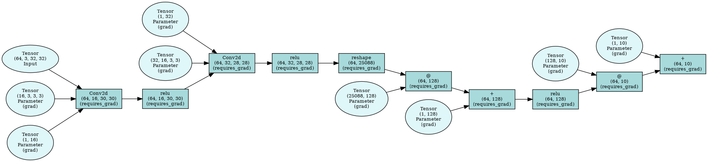

# nnetflow — lightweight neural networks for learning

[](https://www.python.org/)
[](LICENSE)
[](https://github.com/lewisnjue/nnetflow/actions)


nnetflow is a small, opinionated deep learning library implemented with NumPy for education and experimentation. It focuses on readability and a small, correct autodiff core so you can learn how deep learning frameworks work under the hood.

Key design goals:
- Minimal API surface: easy to read and reason about
- Correct reverse-mode autodiff (dynamic graphs)
- A focused set of layers, losses, and optimizers for learning — not a production framework
- Pure NumPy/SciPy: no GPU backend, no CuPy, nothing to configure — just `import` and go
- Well-tested: unit tests cross-check forward/backward results against PyTorch where relevant

This repository represents the **v2.0.6** release, which brings a much larger set of layers (convolutions, pooling, normalization, embeddings, attention, dropout), a proper `Module` base class for building and saving models, and a `draw_dot` / `visualize_model` utility for inspecting computation graphs.

> **Note on GPU support:** nnetflow intentionally does **not** support GPU acceleration. Earlier notes mentioned a CuPy-based device abstraction; that direction was dropped in favor of keeping the codebase small, readable, and easy to reason about for people learning how autodiff and neural networks work. If you need GPU acceleration, use PyTorch or JAX — nnetflow's whole point is to be a transparent teaching tool, not a production framework.

## Highlights

- **Tensor**: NumPy-backed tensor with reverse-mode autodiff and a wide range of activations (`relu`, `leaky_relu`, `elu`, `selu`, `gelu`, `sigmoid`, `swish`, `tanh`, `softmax`, `log_softmax`, ...)
- **Layers**: `Linear`, `Conv1d`, `Conv2d`, `BatchNorm1d`, `BatchNorm2d`, `LayerNorm`, `Embedding`, `Dropout`, `MCDropout`, `Flatten`, `MaxPool1d`, `MaxPool2d`, `AveragePool2d`, `GlobalAveragePool2d`, `MultiHeadAttention`
- **Losses**: `MSELoss`, `RMSELoss`, `CrossEntropyLoss`
- **Optimizers**: `SGD` (+ momentum/Nesterov), `Adam` (plus `Adagrad` and `RMSProp` in `nnetflow.optim`)
- **Module system**: a small `Module` base class handling parameter discovery, `train()`/`eval()`, dtype casting, and `save()`/`load()` (state-dict or full-model pickling)
- **Visualization**: `draw_dot` / `visualize_model` render the autograd computation graph with Graphviz
- **Examples**: runnable scripts under `examples/` (regression, a small character-level GPT)
- **Docs**: a small MkDocs site under `docs/` with a quick start guide, conceptual guide, and API reference
- **CI**: GitHub Actions runs the full test matrix on push and PRs
- **Local checks**: `pre-commit` configured to run tests before pushing changes

## Install

Install from PyPI (when published):

```bash
pip install nnetflow
```

Or install editable from source (recommended for contributors):

```bash
git clone https://github.com/lewisnjue/nnetflow.git
cd nnetflow
pip install -e .
pip install -r requirements.dev
pre-commit install --install-hooks
```

Note: `pre-commit install` sets up git hooks locally. This repo includes a pre-push hook that runs `pytest` to help prevent regressions before pushing.

## Examples

Examples live in the `examples/` folder and are runnable directly:

```bash
python examples/regression.py
python examples/gpt.py --steps 200
```

They demonstrate model definition (via `Module` subclasses), training loops, loss computation, and parameter updates using the library primitives.

## Quick usage

```python
import numpy as np
from nnetflow import Tensor, Linear, MSELoss, Adam

X = Tensor(np.random.randn(128, 3).astype(np.float32), requires_grad=False)
y = Tensor(np.random.randn(128, 1).astype(np.float32), requires_grad=False)

layer = Linear(3, 1, dtype=np.float32)
opt = Adam(layer.parameters(), lr=1e-2)
loss_fn = MSELoss()

for epoch in range(100):
    preds = layer(X)
    loss = loss_fn(preds, y)

    opt.zero_grad()
    loss.backward()
    opt.step()

    if (epoch + 1) % 10 == 0:
        print(f"epoch {epoch + 1}: loss={loss.item():.4f}")
```

You can also import components individually:

```python
from nnetflow.engine import Tensor
from nnetflow.layers import Linear
from nnetflow.losses import MSELoss, CrossEntropyLoss
from nnetflow.optim import SGD, Adam
```

## Building models with `Module`

Most non-trivial models subclass `nnetflow.module.Module`, store layers as attributes, and implement `forward`:

```python
import numpy as np
from nnetflow import Tensor
from nnetflow.layers import Linear
from nnetflow.module import Module
from nnetflow.optim import Adam

class MLP(Module):
    def __init__(self, in_features, hidden, out_features):
        super().__init__()
        self.linear1 = Linear(in_features, hidden, dtype=np.float32)
        self.linear2 = Linear(hidden, out_features, dtype=np.float32)

    def forward(self, x: Tensor) -> Tensor:
        return self.linear2(self.linear1(x).gelu())

model = MLP(10, 64, 1)
optimizer = Adam(model.parameters(), lr=1e-3)

# model.parameters() recursively collects every Tensor with requires_grad=True
# model.train() / model.eval() propagate through nested layers (e.g. Dropout, BatchNorm)
# model.save("weights.pkl") / model.load("weights.pkl") persist a state dict
```

## Testing

Run unit tests locally with:

```bash
pytest tests/ -q
```

CI runs tests automatically on push and pull requests.

## Pre-commit

This project uses `pre-commit` to run basic checks and to run `pytest` before pushing. After cloning run:

```bash
pip install pre-commit
pre-commit install --install-hooks
```

To run the hooks locally (including the pytest hook configured for pre-push):

```bash
pre-commit run --all-files
```

## API Reference

### Tensor Operations

The `Tensor` class is the core of nnetflow, providing automatic differentiation:

```python
from nnetflow import Tensor
import numpy as np

# Create tensors
x = Tensor(np.array([1.0, 2.0, 3.0]), requires_grad=True)
y = Tensor(np.array([4.0, 5.0, 6.0]), requires_grad=True)

# Operations
z = x + y          # Addition
z = x * y          # Multiplication
z = x / y          # Division
z = x @ y           # Matrix multiplication (if compatible shapes)
z = x.sum()         # Sum reduction
z = x.mean()        # Mean reduction

# Activations
z = x.relu()        # ReLU
z = x.sigmoid()      # Sigmoid
z = x.tanh()         # Tanh
z = x.softmax()      # Softmax
z = x.gelu()         # GELU

# Backward pass
z.sum().backward()   # Compute gradients
```

### Layers

```python
from nnetflow import Linear, Conv2d, BatchNorm2d, MultiHeadAttention, Dropout

layer = Linear(in_features=10, out_features=5, bias=True)
output = layer(input_tensor)
params = layer.parameters()  # Get trainable parameters (inherited from Module)
```

### Loss Functions

```python
from nnetflow import MSELoss, RMSELoss, CrossEntropyLoss

mse = MSELoss()
loss = mse(predictions, targets)

rmse = RMSELoss()
loss = rmse(predictions, targets)

ce = CrossEntropyLoss()
loss = ce(log_or_soft_predictions, one_hot_targets)
```

### Optimizers

```python
from nnetflow import SGD, Adam

# SGD with optional momentum
optimizer = SGD(params, lr=0.01, momentum=0.9)

# Adam optimizer
optimizer = Adam(params, lr=0.001, beta1=0.9, beta2=0.999)

# Training step
optimizer.zero_grad()  # Clear gradients
loss.backward()        # Compute gradients
optimizer.step()       # Update parameters
```

## Project structure

```
nnetflow/                 # package source
  engine.py               # Tensor & autodiff engine
  layers.py               # Linear, Conv1d/2d, BatchNorm, LayerNorm, pooling, attention, etc.
  losses.py               # loss functions
  module.py               # Module base class: parameters, save/load, train/eval
  optim.py                # optimizers (SGD, Adagrad, RMSProp, Adam)
  visualize.py            # draw_dot / visualize_model (Graphviz)
docs/                      # MkDocs documentation site
examples/                  # runnable examples
tests/                      # unit tests
```

## Documentation

A small documentation site lives under `docs/` (quick start, conceptual guide, and an auto-generated API reference via `mkdocstrings`). Build it locally with:

```bash
pip install mkdocs mkdocs-material "mkdocstrings[python]"
mkdocs serve
```

## Contributing

Contributions are welcome. Please follow these steps:

1. Fork the repository and create a feature branch
2. Write tests for your change
3. Run `pytest` and `pre-commit` locally
4. Open a pull request with a clear description

See `CONTRIBUTING.md` for more details.

## Changelog

See [CHANGELOG.md](CHANGELOG.md) for release history and the [nnetflow v2.0.6 release notes](RELEASE_NOTES_2.0.6.md). The repository is now at v2.0.6.

## License

MIT — see `LICENSE`.

---

Maintained by Lewis Njue — aimed at learners and educators building intuition about how neural networks work.
